  

 

## About Me

I'm Zaid a full-stack developer who enjoys turning ideas into fast, well-built products. I like clean code, thoughtful design, and figuring out how things work under the hood.

- 🔭 Currently building projects with **React**, **Node.js**, and **Python**
- 🌱 Always picking up something new — right now it's deepening my backend & systems knowledge
- 💬 Ask me about JavaScript, web dev, or anything full-stack
- ⚡ Fun fact: my code always compiles on the first try... eventually

 

## Tech Stack

 

## GitHub Stats

 

## Contribution Graph

 

Thanks for stopping by 👋

